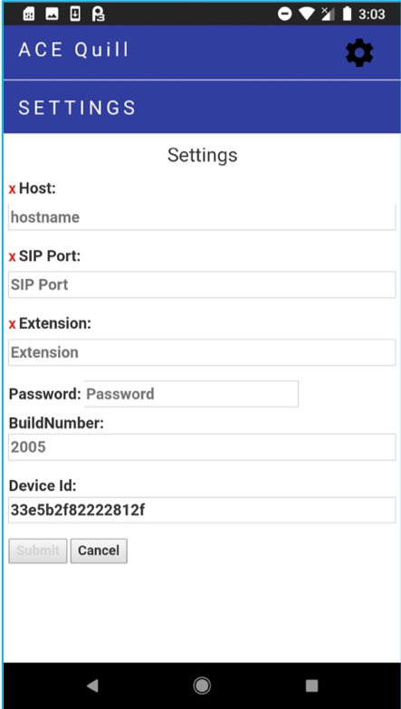

# ACE Quill Android App

The ACE Quill Android App is a Session Initiation Protocol (SIP) testbed for
Internet Protocol (IP) Captioned Telephony.

## Capabilities

The ACE Quill Android App can make outbound calls through an Asterisk server.
At time of this writing (October 2018) it cannot accept incoming SIP calls.

## Architecture

The ACE Quill Android App is an Apache Cordova mobile application.  It is
written in TypeScript, transpiled to JavaScript with embedded javascript (EJS)
templates, CSS, and image files.

The target is currently Android only. Cordova does support iOS as a target,
however it wasn't attempted as part of this development.

The ACE Quill Android App is a mobile application written in TypeScript that
uses Embedded JavaScript (EJS) templates. The Android app is built using
Apache Cordova, an open source mobile development framework. Apache Cordova
allows developers to use the same source code base and build applications for
multiple target platforms (e.g., Android and iOS). For this development effort,
only the Android app was developed. The Apache Cordova toolkit supports
multiple host platforms so the ACE Quill Android app may be built on macOS,
Linux, or Windows platforms.

## Required Tools
To build ACE Quill Android App, the following tools must be installed on a
development machine (macOS, Windows or Linux):

  * [Java Developer Kit](https://java.com) - The standard software development
  environment for developing Java applications, available from Oracle
  * [Android Studio](https://developer.android.com/studio/install.html) - The
  official Integrated Development Environment (IDE) for Android, available
  from Google
  * [Node.js](https://nodejs.org) - JavaScript runtime used by the build
  tools and Cordova
  * [Cordova](http://cordova.apache.org) - The Apache Cordova mobile application
  framework
  * [Yarn](http://yarnpkg.com) - Manages installation of JavaScript packages
  (alternative to npm)
  * [Gulp](http://gulpjs.com) - Toolkit used to compile and package code

Install the following tools with the specified versions:
* Node.js with a version >=8
* Yarn from the developer website (not with npm)
* Java Developer Kit version (jdk 1.8, at the time of this writing, Cordova
  did not work correctly with jdk >= 9)
* Android studio from the website
* Cordova by typing:  `yarn global add cordova`
* Gulp by typing: `yarn global add gulp`

## Download the Client Source Code
`git clone https://github.com/FCC/ace_quill/ace_quill_app.git`

### Building the Android App
Due to the large size of the Cordova build, the app is built in two steps.
The first step is to establish the Cordova "skeleton" or template project.
The second step repeatedly builds and copies into the template to make mobile
client builds.

### Prior to Running Builds
Before attempting to build the ACE Quill Android App, verify the following:
1.	Network proxy settings are correct since both yarn and cordova will need
to pull code and data from the internet
2.	ANDROID_HOME environment variable is set and points to the correct
directory

### First Time Build
The first time you prepare this environment, you will need to install the
Cordova template.

In the top-level directory (macOS or Linux), type:

`cordova-install.sh`    

On Microsoft Windows, type:

 `cordova-install.bat`

### Building the ACE Quill Android App
In the top-level directory, type the following to install all necessary
packages:

1. `yarn install`
1. `npm install`
1. `gulp build`
1. `cd cordova/ACEQUILL`
1. `rm -rf platforms`
1. `cordova platform add android`
1. `cd ../..`
1. `gulp build`
1. `cd cordova/ACEQUILL`
1. `cordova build` (optional --release)

Locate the compiled APK file:
*  `cd platforms\android\bin`

Note, the Android app by default will be named android-debug.apk (or
  android.apk if run with --release).

### Additional Gulp Commands
To see what other commands are available, type:

`gulp help`

### Installing the App on the Android Phone
Installing onto the phone requires that the phone be configured in developer
mode, since the application is not currently in the Google Play Store.

**Note** - The phone must be secured with a password in order for secure storage
of credentials to work properly.

The following instructions were developed using a Google Pixel running Android
version 8.x and may vary for other versions of Android.

If installed, delete current version of the app from the Android phone:
1.	Long-press the app icon
2.	Drag to "remove" in the upper left-hand corner

Enable USB debugging on Android phone:
1.	On the Android phone, go to Settings > Developer Options > USB debugging
2.	Toggle on

Enable file transfer on Android phone:
1.	On the Android phone, swipe down from the top of the homepage
2.	Tap the Android System notification (which may say "USB for charging")
3.	Select use USB for "Transfer files (MTP)"

Allow Android apps from outside of the Google Play Store:
1.	On the Android phone, go to Settings > Security (may be called "Lock Screen
and Security")
2.	Toggle on "Unknown sources"

macOS - Upload debug APK to Android phone from your computer:
1.	On the Mac, download and/or open "Android File Transfer" app
2.	Connect phone to computer via USB or USB-C cable
3.	In Android File Transfer, navigate to the "Download" folder
4.	Drag the APK file from your computer into the "Download" folder

Microsoft Windows - Upload debug APK to Android phone from your computer:
1.	Connect phone to computer via USB or USB-C cable
2.	Select "File Transfer" on the notification window
3.	On the computer in Windows Explorer, navigate to Pixel XL > Internal
Storage > Download
4.	Drag APK file into Download folder

Install debug APK on Android phone:
1.	On the Android phone, go to Settings > Storage > Explore
2.	Click on the debug APK file
3.	Install

Modify permissions after install on the Android phone:
1.	Open settings > apps > ACE Quill
2.	Select "Permissions"
3.	Toggle on all the permission options (Camera & Microphone)

Add app icon to homepage on Android phone:
1.	Go to homepage
2.	Swipe up from the bottom of the page to display the apps drawer
3.	Long-press the app icon you want to add to the Home screen
4.	Drag the app to the Home screen page

Configuring the Client
Once the client is installed onto an Android device, there are a number of
settings on the client that must be configured before the client places a call.

Using the client, select the gear (upper right) and select Settings and you
will see the screen shown in Figure 1. Then fill out the form with parameters
provided by the system administrator and select the Submit button to go to the 
opening page of the app.

  

  Figure 1. ACE Quill Client Settings Example.

### NOTICE

This (software/technical data) was produced for the U. S. Government under
Contract Number HHSM-500-2012-00008I, and is subject to Federal Acquisition
Regulation Clause 52.227-14, Rights in Data-General. No other use other than
that granted to the U. S. Government, or to those acting on behalf of the U. S.
Government under that Clause is authorized without the express written
permission of The MITRE Corporation. For further information, please contact
The MITRE Corporation, Contracts Management Office, 7515 Colshire Drive,
McLean, VA 22102-7539, (703) 983-6000.

©2018 The MITRE Corporation.
